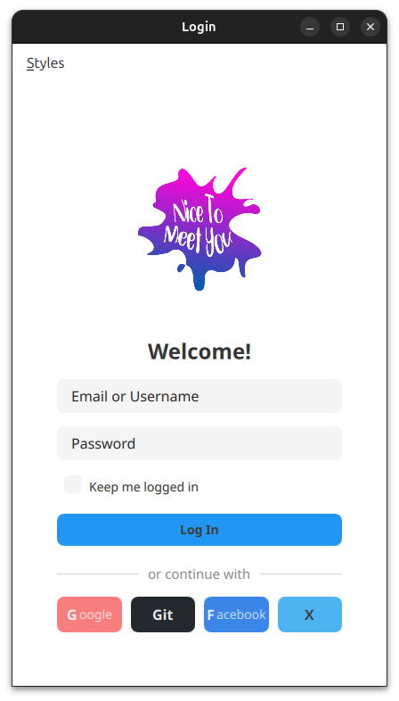
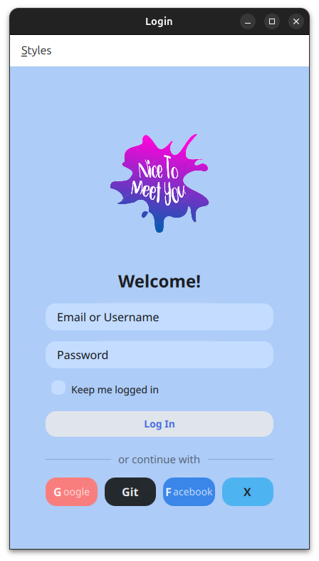
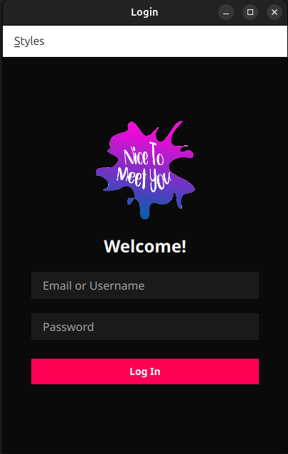
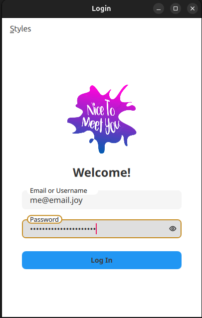
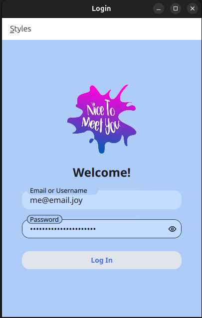
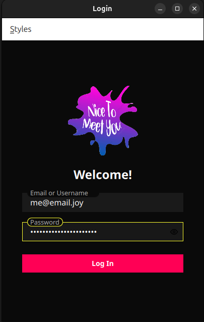

# Adaptive Style Showcase

A Qt/QML application demonstrating dynamic UI styling capabilities with multiple design paradigms.

## Style Examples

<div align="center">
  
  
  
</div>

<div align="center">
  
  
  

</div>

## Features

- Real-time style switching between:
  - Modern
  - Neumorphic
  - Glassmorphic
  - Material
  - Gaming

- Customizable components:
  - Styled inputs
  - Styled buttons
  - Dynamic color schemes
  - Custom typography

## Building

1. Ensure Qt 6.2+ is installed
2. Clone the repository
3. Build using CMake or QtCreator:

```bash
mkdir build && cd build
cmake ..
make
```

## Roadmap

- ✅ Fix main window
- ✅ Add wasm compilation
- ✅ Fix styles
- ✅ Enriched Readme
- 💾 Add save login data to local storage
- 🌐 Deploy to GitHub Pages
- 🔑 Add SSO (Google, Facebook, GitHub, etc)
-  fix bash build script
- 📱 Mobile friendly UI

## License

MIT License