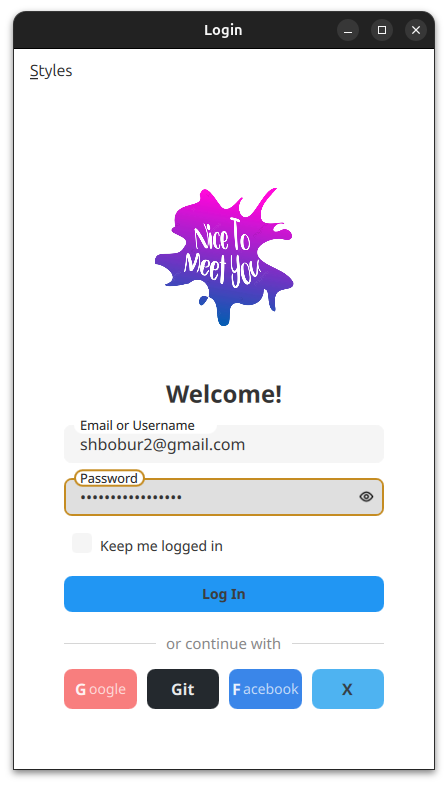
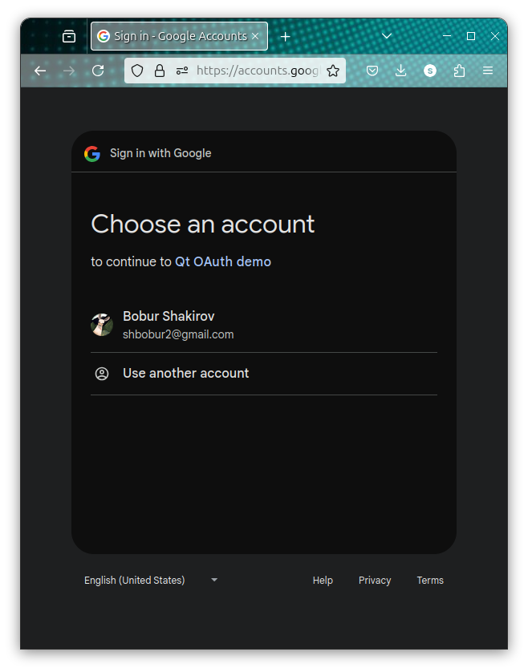
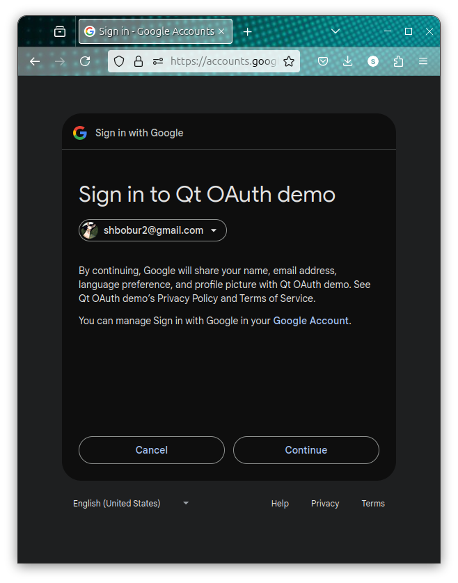
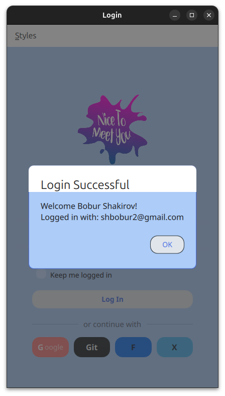

# Adaptive Style Showcase

A Qt/QML application demonstrating dynamic UI styling capabilities with multiple design paradigms.

## Style Examples

<div align="center">
  
  
  
</div>

## Features

- Real-time style switching between:
  - Modern
  - Neumorphic
  - Glassmorphic
  - Material
  - Gaming

- Customizable components:
  - Styled inputs
  - Styled buttons
  - Dynamic color schemes
  - Custom typography

- Google Sign-in Integration:
  1. Follow [this post](https://www.auronsoftware.com/kb/general/miscellaneous/google-oauth2-how-to-setup-a-client-id-for-use-in-desktop-software/) to create OAuth 2.0 credentials
     - Create a new project or select existing one
     - Configure OAuth consent screen
     - Create OAuth 2.0 Client ID

  2. Open `src/oauth/googleauth.h` and replace the credentials:
     ```cpp
     const QString clientId = "your-client-id-here";
     const QString clientSecret = "your-client-secret-here";
     ```
  3. Run the app and click the "Google" button
     <div align="center">
      
      
      
     </div>
  4. After successful authentication:
     <div align="center">
       
     </div>

## Build Instructions

This project uses CMake as its build system. You can build it either using Qt Creator IDE or command line.

### Option 1: Using Qt Creator (Recommended)

1. Open Qt Creator
2. Select "Open Project" and navigate to the project directory
3. Select the `CMakeLists.txt` file
4. Configure the project with your preferred kit
5. Click "Build" or press Ctrl+B (Cmd+B on macOS)

### Option 2: Command Line Build (Linux)

#### Prerequisites
- CMake (3.16 or higher)
- Qt 6.x installed

#### Standard Method
If Qt is installed system-wide, you can use the standard CMake commands:

```bash
mkdir build && cd build
cmake ..
make
```

#### Alternative Method
If Qt is installed in a home directory or other path, the standard CMake command might fail to locate Qt. In this case, create a build script (`qt-build.sh`):

```bash
#!/bin/sh
QT_DIR=~/Qt/6.8.1/gcc_64  # Adjust this path to your Qt installation, version, and preferred kit
cmake -DCMAKE_PREFIX_PATH=$QT_DIR \
      -DCMAKE_TOOLCHAIN_FILE=$QT_DIR/lib/cmake/Qt6/qt.toolchain.cmake \
      "$@"
```

Then build using:

```bash
chmod +x qt-build.sh
mkdir build && cd build
../qt-build.sh ..
make
./login-portfolio
```


### Troubleshooting

If you encounter "Could not find a package configuration file provided by Qt6", it means CMake cannot locate your Qt installation. Try:
1. Verify your Qt installation path
2. Use the alternative build script method above
3. Check if all required Qt modules are installed

## Roadmap

- ✅ Fix main window
- ✅ Add wasm compilation
- ✅ Fix styles
- ✅ Enriched Readme
- ✅ Add save login data checkbox
- ✅ Add SSO (Google, Facebook, GitHub, etc) buttons
- ✅ Fix bash build script
- ✅ Add Google SignIn
- ✅ Add GitHub SignIn
- ✅ Add Facebook SignIn
- 🔑 Add X SignIn
- 🔐 Add Encrypted secrets store
- 📱 Mobile app: make it work on mobile, all features
- 🌐 Deploy to GitHub Pages (wasm)
- 🎨 Add more styles, examples: https://freefrontend.com/css-login-forms/

## License

Apache-2.0
